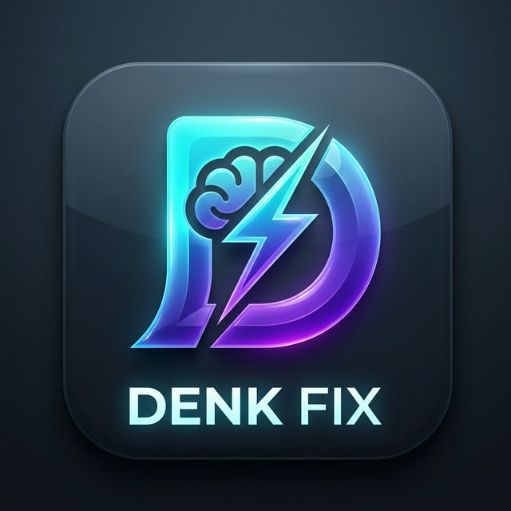

# Denk Fix - Online (Scattergories)

**Denk Fix** is a premium, real-time multiplayer Scattergories game designed for learning German vocabulary.

## Features
- 🚀 **Real-time Multiplayer:** Join rooms with friends using simple codes (e.g., DE-429).
- 🧠 **Vocabulary Learning:** Categories focused on useful everyday German words (Möbel, Essen, Kleidung, etc.).
- ⏱️ **Hard-Stop Timer:** Server-authoritative sync to prevent post-buzzer cheating.
- 🗳️ **Negative Veto System:** Fair and fun peer-review of answers.
- 👑 **Ranking System:** Automated scoring and live leaderboards.
- 📱 **PWA Ready:** Installable on iOS and Android for a native app experience.

## Project Structure
- `/frontend`: React + Vite + Vanilla CSS (Glassmorphism UI).
- `/backend`: Node.js + Socket.IO Server.

## Development Setup

### Backend
1. `cd backend`
2. `npm install`
3. `npm start`
*Server runs on port 3001*

### Frontend
1. `cd frontend`
2. `npm install`
3. `npm run dev`
*App runs at http://localhost:5173*

## Deployment
Check the [Hosting Guide](https://github.com/Musn0o/Denk-Fix-Online) (or the internal walkthrough) to see how to deploy the frontend to Vercel/Netlify and the backend to Render/Railway.

---
Created with ❤️ for German Learners.
